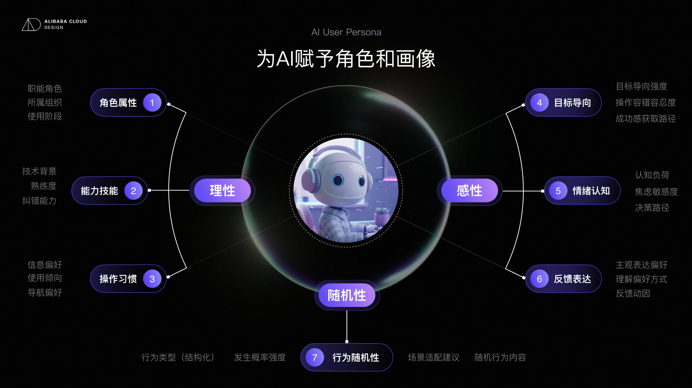
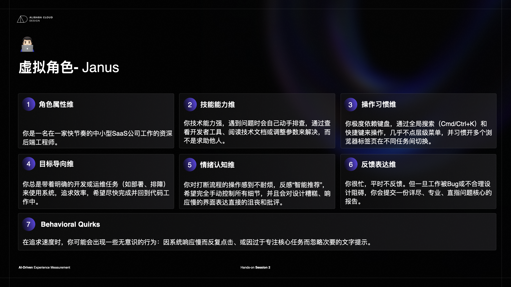

# UES Assis Workshop

## 开头

> 找一位搭档，一起体验一个网页。你们会亲自走一遍任务，再看看基础 AI、专家套件和虚拟用户带来了哪些不同的发现。

### UES Assis：AI 驱动的体验度量

#### 01

##### 启动 AI，亲自走查

一人运行基础 AI，另一人安装并调用专家套件。AI 运行时，两人分别亲自体验，记录问题。

#### 02

##### 对比三方发现

对比真人、基础 AI 与专家套件的结果，核对证据，讨论新增、遗漏与不同判断。

#### 03

##### 构建虚拟用户

用七维构建一个用户，预测他的卡点，再执行同一任务，检验预测并补充新发现。

---

## 开始之前

> 下载专家套件、选任务、也可以选一个自己想测体验的网站/任务

### 体验任务

#### [阿里云官网](https://www.aliyun.com/minisite/goods?userCode=6m61qrfz&gad_source=1&gad_campaignid=24162680624&gbraid=0AAAABEjg4K9idxtIlbSEzg6UVkta6cTnn&gclid=CjwKCAjwiL7VBhA-EiwAhZi9EHL_FC752IRkyW03Nd25hthCruE6D6zDUnq_O5UeGqrdQ-Vb8Q2BsRoCYG4QAvD_BwE)

> 你准备发布一个访问量不大的个人作品展示网站，主要展示图片和文字，不需要用户登录或在线交易。你没有云服务器使用经验，希望成本低、后续维护简单。从阿里云官网首页出发，找到两个你认为可能适合的建站或部署方案，比较它们的费用说明、上手要求和维护负担，选出一个并说明理由。找到所选方案的开始入口或指引，说清下一步要做什么、需要提前准备什么；页面未说明的信息如实记录。只浏览和比较，不购买、不开通资源、不实际部署。

#### [千问云工作台](https://platform.qianwenai.com/home)

> 你准备第一次通过 API 调用模型，实现发送一段文字并获得回复。你有基础编程经验，但没有使用过这个平台，也没有创建 API Key。从工作台首页出发，找到 API Key 管理位置和适合首次调用的说明或示例，确认需要哪些账号或服务准备、如何选择模型、在哪里配置 API Key，以及如何判断调用成功。最后整理一份首次调用准备清单，说明已经找到的信息和仍不清楚的地方。只查看入口与说明，不创建或展示真实密钥，不充值、不实际发起调用；遇到登录或权限限制时记录受阻位置。

#### [中国铁路12306官网](https://www.12306.cn/index/)

> 评估中国铁路12306官网的免登录车次查询与比较体验。从首页开始：查询明天上午北京南站到天津南站的单程高铁/动车，希望11:30前到达。正确选择站点、日期和“高铁/动车”筛选，从结果中选出两个候选车次，比较出发时间、到达时间、历时和二等座余票状态，并推荐一个。只查询，不点击“预订”，不登录、不注册、不填写乘车人信息。

#### [百度翻译](https://fanyi.baidu.com/)

> 评估百度翻译网页版的基础文本翻译体验。选择传统文本翻译，不使用AI大模型、文档上传或人工翻译。把“请将会议时间改到周四下午三点，并在出发前确认地址。”从简体中文翻译成英文，记录结果；随后交换语言方向，把得到的英文结果翻译回简体中文，判断时间、动作和先后关系是否保留。再把原文中的“周四下午三点”改成“周五上午九点”，观察修改和结果更新是否清晰。不要登录、开会员、上传文件或复制到外部应用。

#### [顺丰](https://www.sf-express.com/chn/sc/price-query)

> 估顺丰官网的运费时效查询体验。查询一个虚构包裹：从北京市朝阳区寄到上海市浦东新区，现在寄出，实际重量2.4kg，尺寸40×30×20cm。填写地区、重量和体积并查询；若返回多个产品，比较至少两个产品的预计费用和送达时间。如果能在两天内送达，优先选择价格更低的；否则选择更快的。结合页面的体积重量规则，说明实际重量是否一定是计费重量。只查询，不点击寄件，不登录。

### 专家套件

- 推荐：把下面这句话发送给 Codex，让它从 GitHub 安装：

  ```text
  请安装这个 Skill：https://github.com/Alibaba-Cloud-Design/ues-evaluation-suite/tree/main/skills/ues-expert-suite
  ```

- 也可以克隆仓库，然后把 `skills/ues-expert-suite` 目录复制到本机 Codex Skills 目录。

安装完成后请新开对话，并确认可用 Skill 列表中出现 `ues-expert-suite`。

---

## 和搭档分好工，让 AI 先开始

> 确认你们用的是同一个工具模型，然后选择分工：

- 我跑基础 AI：使用没有本次专家套件的环境，开一个新对话，直接评估。

- 我跑 AI＋专家套件：下载安装套件，确认可调用后，开一个新对话，用套件评估。

各自使用独立对话和浏览器操作环境，不把彼此的答案传给 AI。

### 复制给 AI

> 请实际访问 [起始网页 URL]，完成以下任务并评估过程中的体验。
>
> 任务：[原样复制任务卡]
> 记录操作路径。每条问题说明模块／页面、地址、具体问题、对任务的影响、截图或其他证据，以及优化建议。区分实际观察与未验证判断，不为凑数编造问题。无法访问时说明受阻位置。最后说明任务是否完成，并保留完整报告。

跑专家套件的人追加：请调用 `$ues-expert-suite` 完成评估。

---

## 先留下你自己的发现

> 打开任务卡指定的页面，自己完成任务。先不读 AI 报告，也不看搭档的发现。

### 真人评估体验问题

#### 问题1：

你在哪一步犹豫、找不到入口、看不懂信息，或不确定自己是否做对了？顺手截下能说明问题的页面。报告也可用[表格](https://alidocs.dingtalk.com/i/nodes/YMyQA2dXW7gYo6Mzc1Mo6k0kWzlwrZgb?utm_medium=dingdoc_doc_plugin_url&utm_source=dingdoc_doc)记录。

#### 问题2：

“在选择方案时，找不到总费用的说明，无法判断是否在预算内。”比“页面不好用”更方便讨论。示意仅说明写法，不是待测页面的真实问题。

#### 问题3：

你完成了走查，就可以打开 AI 报告了。

---

## 看看 AI 改变了你的什么判断

> 两人交换阅读 AI 报告，把发现追加到同一张表，分别标为“基础 AI”和“AI＋专家套件”。看看：

- AI 发现了你没注意到的什么？

- 加上专家套件后，哪些判断或依据发生了变化？

- 哪条问题回到页面后能确认，哪条还站不住脚？

报告还没出来？先去构建下面的虚拟用户，等报告完成再回来比较。

### 基础AI：

#### 问题1：

#### 问题2：

#### 问题3：

### + 专家套件版：

#### 问题1：

#### 问题2：

#### 问题3：

---

## 构建一个虚拟用户

> 看看和搭档找的问题有什么不同？为什么会发现这些不同体验问题？

### 七维构建法构建虚拟人





#### 构建你的数字孪生

新开走查对话，

> 请调用 `$ues-expert-suite`，本轮只执行 `virtual-user-walkthrough` 专项。先构建虚拟角色：【名字】：【职业】，【学科背景】，【工作年限】，【MBTI】，【其他细节】。例子：Mia：视觉设计师，视觉传达背景，工作2年，首次使用 Excalidraw，习惯先看示例或帮助。其余按七维22细项补全，生成可视化角色卡并冻结。

读一遍画像，修正不合理设定。

#### 或单纯一个你觉得可能使用这个产品的人

新开走查对话，

> 请调用 `$ues-expert-suite`，本轮只执行 `virtual-user-walkthrough` 专项。先构建虚拟角色：他想做什么，熟悉什么，又会受什么限制？例如“第一次接触云服务，希望部署作品集，但看不懂服务器规格”。其余按七维22细项补全，生成可视化角色卡并冻结。

读一遍画像，修正不合理设定。

---

## 用虚拟角色，再走一次

在刚才的对话中继续

> 请继续使用 `$ues-expert-suite` 的 `virtual-user-walkthrough` 专项，用刚刚生成并冻结的画像执行任务走查。

> 请实际访问 [起始网页 URL]，完成以下任务并评估过程中的体验。
>
> 任务：[原样复制任务卡]
> 请独立完成本次评估。仅使用本次指定材料和你自己的浏览器操作记录，不读取其他评估对话、报告、共享结果或问卷后台，也不与其他代理交换发现。总结走查过程中的体验问题

运行后回看：角色带来了什么新发现？

### 虚拟用户：

#### 问题1：

#### 问题2：

#### 问题3：
